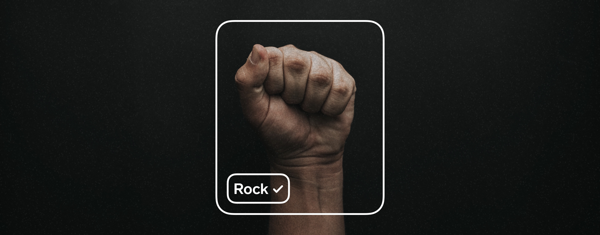

 

[Lobe](http://lobe.ai/) is a free, easy to use app that has everything you need to bring your machine learning ideas to life. This project gives you all the files you need to follow the tutorials that come with the Machine Learning Kit by Adafruit.

## Machine Learning Kit

We’ve worked together with Adafruit to offer a machine learning kit conceived from the ground up to help you bring your machine learning ideas to life. Specifically, the kit includes the Raspberry Pi board, a camera module to capture all your images and later use your model, and all the smaller components to connect the two together. You can buy the kit [here](link/to/tutorial).

## Tutorials

With the machine learning kit, we've prepared three easy, medium and hard tutorials to put Lobe and the Machine Learning kit to work together, while introducing to everything that's possible with machine learning.

### **Machine Learning 101** 
The first tutorial is the easiest one to follow because it helps you recognize common house objects. It also helps you get familiar with Lobe, with machine learning, and with the components of the kit. Find the tutorial [here](link/to/tutorial).

### **Rock, Paper, Scissors** 
Machine learning is a really powerful tool that can help computers recognize the things they see. In this second tutorial, we'll train a machine learning model that can recognize the rock, paper and scissors gestures, so we can play with it. Find the tutorial [here](link/to/tutorial).

### **Package Detector** 
We use machine learning to solve common tasks that are too tedious to do over and over, and this is the perfect example of something you can build at home. The third tutorial is a front door package detector. Find it [here](link/to/tutorial).

## Contributing

GitHub Issues are for reporting bugs, discussing features and general feedback on this project. Be sure to check our documentation, FAQ and past issues before opening any new ones.

To share your project, get feedback on it, and learn more about Lobe, please visit our community on [Reddit](https://www.reddit.com/r/Lobe/). We look forward to seeing the amazing projects that can be built, when machine learning is made accessible to you.
